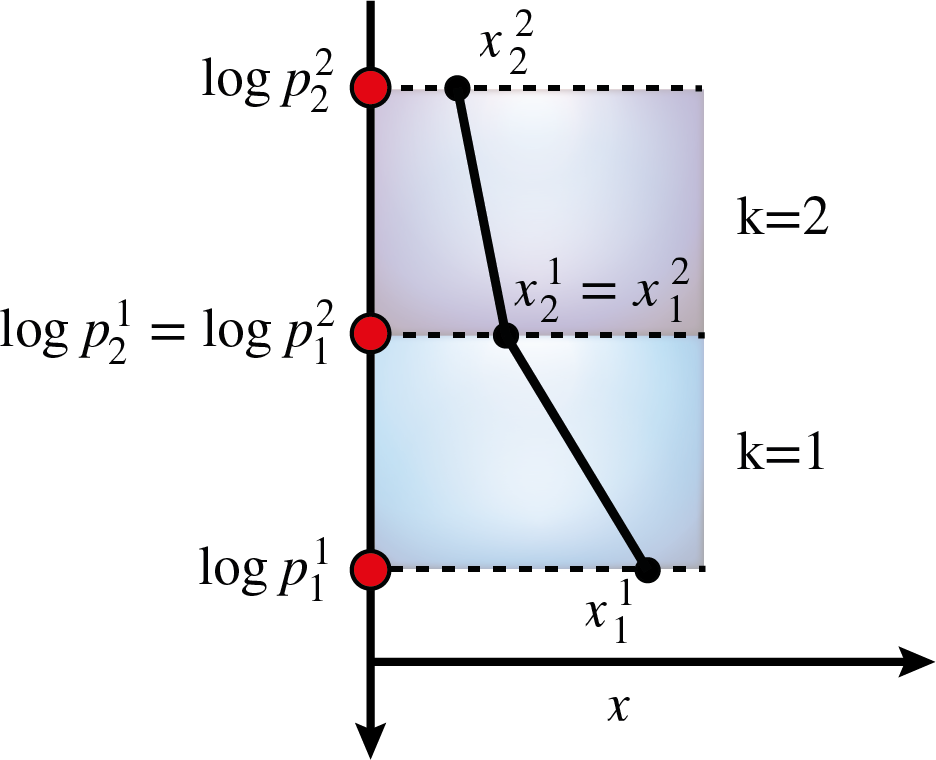
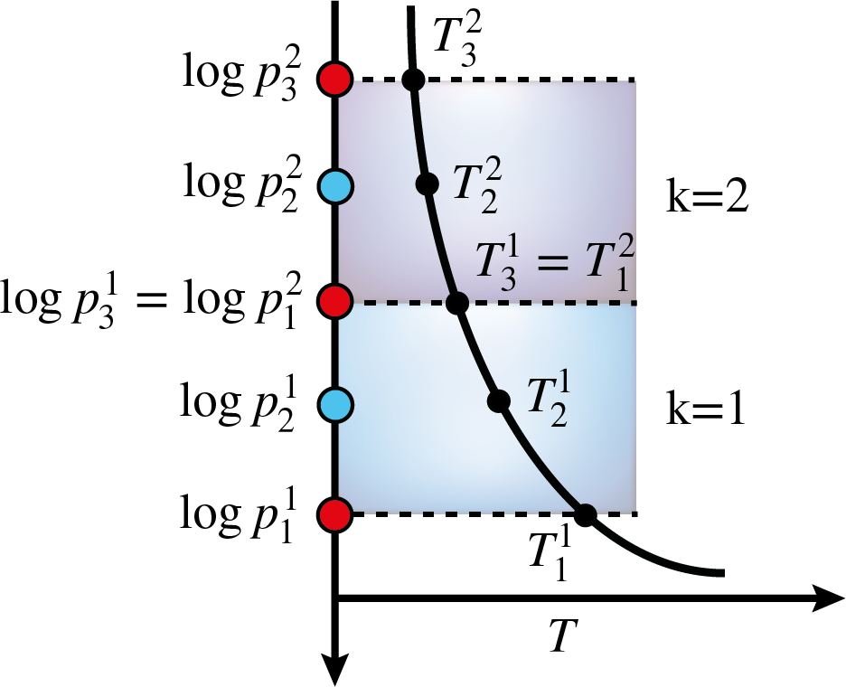

.. _sec:chemistry_models:

Chemistry Models
=================

BeAR currently includes the following chemistry models:

  - equilibrium chemistry

  - isoprofiles

  - piecewise polynomial

  - cubic b splines

Isoprofile
----------

Isoprofiles are the most simple but also often used approximation 
for parametrising the chemical composition. In this approximation,
the abundance of a chemical species is assumed to be constant throughout
the atmosphere. This yields one free parameter for each chemical species
included in the retrieval. 

In the corresponding ``forward_model.config`` of the chosen forward model, 
the isoprofile chemistry model is chosen by setting 

Piecewise polynomial
--------------------

Cubic b splines
---------------

Cubic b splines are very similiar to the piecewise polynomial model, in 
the sense that they approximate the 
The difference between the two descriptions is that cubic b splines
also have continous first and second derivatives. This leads to the
abundance profiles being very smooth. It should be noted, though,
that a more smooth profile is not necessarily more correct

Equilibrium chemistry
---------------------

Mixing different chemistry models
---------------------------------

